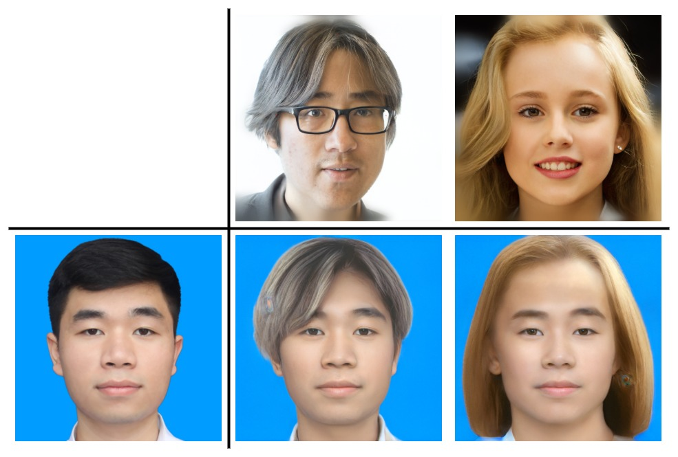

# HairstyleGAN

HairstyleGAN is Graduation Assignment in FPT University of Ta Dang Khoa and Pham Cao Bang

## Directory layout
```
.
├── configs         # store all configs
├── core            # model, loss, optimizer, metrics, dataloader, ...
├── data
├── docs
├── exp             # weights, processed data features, ...
│   ├── features
│   └── weights
├── modules         # pre-process, post-process, ...
├── service         # REST API app
├── tools           # scripts for train, test, ...
└── utils
```

## Generate data
```
python tools/generate.py --outdir=data --trunc=1 --seeds=1-100 --network=https://nvlabs-fi-cdn.nvidia.com/stylegan2-ada-pytorch/pretrained/ffhq.pkl
```

## Align images
```
mkdir exp/features/aligned_images
mkdir exp/features/landmarks
python tools/align_images.py data/ exp/features/aligned_images/ --landmarks_path=exp/features/landmarks/
```

## Result


## License

MIT
